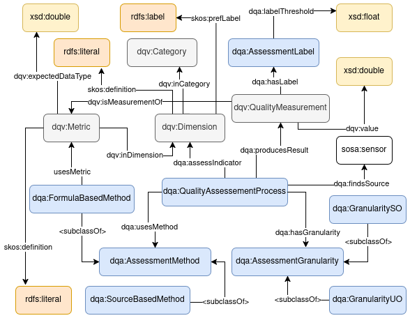
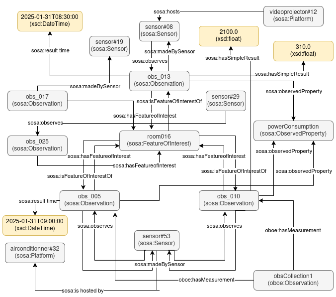

# Data Quality Assessment Ontology (DQA)

## Table of Contents
1. [About the Ontology](#about-the-ontology)
   - [Overview](#overview)
   - [Ontology Classes](#ontology-classes)
   - [Object Properties](#object-properties)
   - [Data Properties](#data-properties)
   - [usage](#usage)
2. [Download](#Download)
3. [Contributors](#contributors)
4. [Contact](#contact)

## About the ontology

### Overview

The **Data Quality Assessment Ontology (DQA)** is a suggested extension of the [Data Quality Vocabulary (DQV)](https://www.w3.org/ns/dqv#) designed to enhance the assessment of data quality (DQ). It introduces structured evaluation processes, traceability of applied methods, granularities for assessments, and results of applying DQ indicators.

Below is a diagram that represents the DQ Assessment Ontology (DQA):

<p align="center">
  
</p>

### Ontology Classes

The ontology defines the following key classes:

- **QualityAssessmentProcess**: Represents the process of evaluating DQ.
- **AssessmentGranularity**: Represents the level at which DQ is assessed (e.g., unique observation, set of observations).
- **AssessmentLabel**: Categorizes the result of a quality evaluation (e.g., "High Quality", "Medium Quality").
- **AssessmentMethod**: Defines the method used for DQ assessment, either formula-based or source-based.
- **FormulaBasedMethod**: A specific type of assessment method based on predefined formulas.
- **SourceBasedMethod**: A specific type of assessment method based on the source of the data.

### Object Properties

The ontology includes the following object properties to define relationships between the classes:

- **assessesIndicator**: Links a quality assessment process to the indicator it evaluates.
- **findsSource**: Links a quality assessment process to the data source identified in the knowledge graph.
- **hasGranularity**: Specifies the granularity level at which DQ is assessed.
- **hasLabel**: Links a quality measurement to an assessment label.
- **producesResult**: Associates a quality assessment process with its resulting evaluation.
- **usesMethod**: Links a quality assessment process to the specific method used.
- **usesMetric**: Defines the metric used in a formula-based method.

### Data Properties

The ontology defines the following data properties:

- **labelThreshold**: Specifies the numerical threshold for assigning a quality label (e.g., "High Quality" threshold = 80%).

## Usage

### Use Case

We consider a simple baseline example. The use case involves five devices installed in a classroom within a campus building. These devices include five sensors: two presence sensors and three integrated into three platforms—an air conditioner, a projector, and a ventilation system—all of which track their energy consumption (in watts) as observations. The use case is described using SOSA.

<p align="center">
  
</p>

### Steps of DQA based approach and examples

#### Step 1: Enriching the Observation

The first step involves receiving an observation and enriching it using the **SOSA** ontology. This phase does not require describing the processing of the observation in terms of representational indicators, as these mainly concern the proper representation of data rather than its qualitative assessment. Once enrichment is completed, the observation is stored in the GC repository to be used in the evaluation phases.

<pre> ```ttl
ex:obs_001 a sosa:Observation ;
    rdfs:comment "Observation of energy consumption from airconditioner#32" ;
    sosa:hasFeatureOfInterest ex:room016 ;
    sosa:hasSimpleResult "1900.0"^^xsd:float .
    sosa:madeBySensor <http://www.w3.org/ns/sosa/examples#PZEM-004T#53> ;
    sosa:observedProperty ex:energyConsumption ;
    sosa:resultTime "2025-01-31T08:00:00"^^xsd:dateTime ;
    sosa:usedProcedure ex:RoomPowerConsumption . 

ex:obs_018 a sosa:Observation ;
    rdfs:comment "Observation of energy consumption from videoprojector#12" ;
    sosa:hasFeatureOfInterest ex:room016 ;
    sosa:hasSimpleResult "510.0"^^xsd:float ;
    sosa:madeBySensor <http://www.w3.org/ns/sosa/examples#PZEM-004T#08> ;
    sosa:observedProperty ex:energyConsumption ;
    sosa:resultTime "2025-01-31T09:45:00"^^xsd:dateTime ;
    sosa:usedProcedure ex:RoomPowerConsumption . ``` </pre>


#### Step 2: Evaluating DQ Indicators at the UO Level

At this step, DQ indicators that can be assessed on a single observation (**UO**) are applied. These include **accuracy**, **provenance**, **relevance**, and **timeliness**. Each indicator is evaluated individually, and the resulting data is stored in the repository with a complete description of the evaluation process using the **SOSA**, **DQV**, and **DQA** ontologies. The **DQV** ontology is used to describe the evaluation of DQ dimensions (indicators), while **DQA** extends this descriptive model by integrating metadata associated with the evaluation process.

##### Formula-Based Method (Accuracy) :

<pre> ```ttl
ex:AccuracyAssessmentobs_018 a dqa:QualityAssessmentProcess ;
    dqa:assessesIndicator ex:Accuracy ;
    dqa:hasGranularity dqa:GranularityUniqueObservation ;
    dqa:producesResult ex:Accuracy_obs_018Result ;
    dqa:usesMethod ex:AccuracyMethod .

ex:AccuracyMethod a dqa:FormulaBasedMethod ;
    dqa:usesMetric ex:MetricAccuracyMethod .

ex:MetricAccuracyMethod a dqv:Metric ;
    skos:defintion "100*(1 - (absolute(observed - expected) / expected))" ;
    dqv:expectedDataType xsd:double ;
    dqv:inDimension ex:Accuracy .

ex:Accuracy a dqv:Dimension ;
    skos:definition "The considered data value must be close to the realistic expected value, ..." ;
    skos:prefLabel "Accuracy"@en .

ex:Accuracy_obs_018Result a dqv:QualityMeasurement ;
    sdmx-attribute:unitMeasure <http://www.w3.org/vocabularies/om-1.8/Percentage> ;
    dqv:isMeasurementOf ex:MetricAccuracyMethod ;
    dqv:value 9.8e+01 . 

 ex:obs_018 a sosa:Observation ;
    rdfs:comment "Observation of energy consumption from videoprojector#12" ;
    sosa:hasFeatureOfInterest ex:room016 ;
    sosa:hasResult [ a dqv:QualityMeasurement ;
            dqv:value 9.8e+01 ] ;
    sosa:hasSimpleResult "510.0"^^xsd:float ;
    sosa:madeBySensor <http://www.w3.org/ns/sosa/examples#PZEM-004T#08> ;
    sosa:observedProperty ex:energyConsumption ;
    sosa:resultTime "2025-01-31T09:45:00"^^xsd:dateTime ;
    sosa:usedProcedure ex:RoomPowerConsumption .      
``` </pre>


##### Source-Based Method (Provenance) :

<pre> ```ttl
ex:ProvenanceAssessmentobs_018 a dqa:QualityAssessmentProcess ;
    dqa:assessesIndicator ex:Provenance ;
    dqa:hasGranularity dqa:GranularityUniqueObservation ;
    dqa:findsSource <http://www.w3.org/ns/sosa/examples#PZEM-004T#08> ;
    dqa:usesMethod ex:ProvenanceMethod .

ex:ProvenanceMethod a dqa:SourceBasedMethod ;
    dqv:inDimension ex:Provenance .

ex:Provenance a dqv:Dimension ;
    skos:definition "Provenance refers to the source of the data values and its description." ;
    skos:prefLabel "Provenance"@en . ``` </pre>


#### Step 3: Evaluating DQ Indicators at the SO-SD and SO-MD Levels

In this final step, the evaluation focuses on sets of observations (**SO-SD** and **SO-MD**). Two types of evaluations can be performed:

- **Task-Agnostic Evaluation**: Some DQ indicators can be evaluated independently of a user-defined objective, only considering the context of the observations’ generation. These indicators include **precision**, **duplication**, and **consistency**.
- **Task-Specific Evaluation**: When a user defines a specific task, additional DQ indicators may be necessary, alongside the three previously mentioned indicators. These include **completeness**, **timeliness**, and **relevance**.

To structure this step, the **OBOE** ontology is used to define the sets of observations on which the evaluation is performed. Then, the evaluation results are documented using **DQV**, and the evaluation process is described using **DQA**.

##### Formula-Based Method (Duplication) :

```ttl
ex:ObservationCollection_1 a obeo:Observation;
    obeo:hasMeasurement ex:obs_001, ex:obs_002, ex:obs_003, ex:obs_004, ex:obs_005 .

ex:DuplicationAssessement_set_obs_1 a dqa:QualityAssessementProcess ;
    dqa:assessesIndicator ex:Duplication ;
    dqa:hasGranularity dqa:GranularitySetObservationsSingleDevice ;
    dqa:producesResult ex:Duplication_set_obs_1_Result ;
    dqa:usesMethod ex:MetricDuplication .

ex:DuplicationMethod a dqa:FormulaBasedMethod ;
    dqa:usesMetric ex:MetricDuplication .

ex:MetricDuplication a dqv:Metric ;
    skos:defintion "100 * (duplication_count / total)"@en ;
    dqv:expectedDataType xsd:float ;
    dqv:inDimension ex:Duplication .

ex:Duplication a dqv:Dimension ;
    skos:definition "The proportion of duplicated observations in a set." ;
    skos:prefLabel "Duplication"@en .

ex:Duplication_set_obs_1_Result a dqv:QualityMeasurement ;
    sdmx-attribute:unitMeasure <http://www.w3.org/vocabularies/om-1.8/Percentage> ;
    dqv:isMeasurementOf ex:MetricDuplication ;
    dqv:value "0.0"^^xsd:float . ```


## Download

To use the DQA ontology in your project, **Download or Clone the Repository**: You can download the RDF file containing the DQA ontology or clone the repository from GitHub.

    ```bash
    git clone https://github.com/yourusername/dqa-ontology.git
    ```

## Contributors

- Oumaima Amal - [LinkedIn](https://www.linkedin.com/in/oumaima-amal/)

## Contact

For further questions or support, please contact Oumaima Amal via email: oumaima.amal63@gmail.com.

